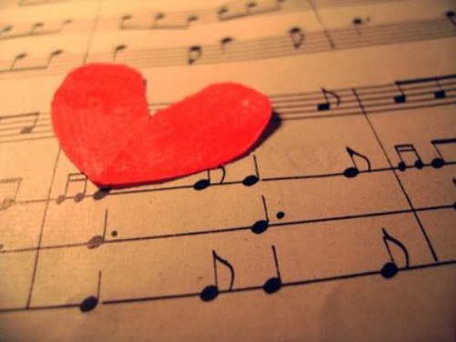

```{r echo=FALSE, out.width="100%", fig.align='center'}

```

# Introduction

How do you feel when listening to different songs? Some songs make people excited, even can make people dance. While some songs remind people of homesick and heart-broken memories. Using the lyrics databse,which is a filtered corpus of 100,000+ song lyrics from MetroLyrics, let's find out the interesting facts hiden inside song lyrics. Particularly, we are going to investigate the following problems:

1. What are most frequently words in the songs of different emotions?

2. In different emotion types, which genre is the most?

3. What are most frequently emotions in the songs of different years and what is the trend of emotion changing over time?

4. Special case study of Rock music


```{r,echo=FALSE, message=FALSE,warning=FALSE}
#Import packages needed
library(tm)
library(data.table)
library(tidytext)
library(tidyverse)
library(DT)
library(plotly)
library(scales)
library(wordcloud)
library(wordcloud2)
library(gridExtra)
library(ngram)
library(ggplot2)
library(dplyr)
library(RColorBrewer)
library(syuzhet)
library(reshape2)
```

# Part 1： What are most frequently words in the songs of different emotions?

First, I import the original dataset called df generated by the text-processing.rmd file. To protect the original dataset, I duplicated it as df.demo, all the operations will be applied to the demo dataset. In the first piece of our data, we can find out that we have 7 variables, "song","years","artist","genre","lyrics","ID" and "stemmedwords". 

```{r,echo=FALSE}
#Load the processed lyrics data
dt_lyrics<-read.csv('~/GitHub/fall2019-proj1--nazhuo/output/dt_lyrics.csv')
df<-data.frame(dt_lyrics)
df.demo<-data.frame(dt_lyrics)
```

## 1.1 Scoring the emotion of each song and grouping the songs into positive and negative songs 

In this part, I conducted a sentiment analysis using *syuzhet* package. The function get_nrc_sentiments evaluated the stemmed word in each song and returns the positive and negative add-up score of it. I grouped the songs with higher positive score into "positive songs" group, and likewise to the negative songs. 

```{r warning=FALSE, echo=FALSE}
#Scoring the emotion of each song
df.emotion<-get_nrc_sentiment(as.character(df.demo$stemmedwords))
#Identifing the positive and negative emotion character of each songs according to the scores
df.demo$np<-rep(NA,125704)
df.demo$np<-ifelse(as.numeric(df.emotion[, 9]>df.emotion[, 10]),"negative",ifelse(as.numeric(df.emotion[, 9]<df.emotion[, 10]),"positive",ifelse(as.numeric(df.emotion[, 9]==df.emotion[, 10]),"draw",NA)))
#Subsetting the data by groups
df.p<-df.demo[df.demo$np=="positive",]
df.n<-df.demo[df.demo$np=="negative",]
```

## 1.2 Building word clouds for positive and negative songs

After subsetting the data, I bulit the word clouds for each group. 

### 1.2.1 Postive Songs

```{r warning=FALSE, echo=FALSE, out.width="80%", fig.align='center'}
corpus.p <- VCorpus(VectorSource(df.p$stemmedwords))
tm.p<-TermDocumentMatrix(corpus.p)
tm.p.tidy <- tidy(tm.p)
wc.p <- summarise(group_by(tm.p.tidy, term), sum(count))
#Building the word cloud
wordcloud(wc.p$term, wc.p$`sum(count)`, scale=c(2,0.5), max.words=100, min.freq=1, random.order=FALSE, rot.per=0.3, use.r.layout=T, random.color=T, colors=c("purple","pink","lightblue"))
```

### 1.2.2 Negative Songs

```{r warning=FALSE, echo=FALSE, out.width="80%", fig.align='center'}
corpus.n <- VCorpus(VectorSource(df.n$stemmedwords))
tm.n<-TermDocumentMatrix(corpus.n)
tm.n.tidy <- tidy(tm.n)
wc.n <- summarise(group_by(tm.n.tidy, term), sum(count))
#Buliding the word cloud
wordcloud(wc.n$term, wc.n$`sum(count)`, scale=c(2,0.5), max.words=100, min.freq=1, random.order=FALSE, rot.per=0.3, use.r.layout=T, random.color=T, colors=c("purple","pink","lightblue"))
```

The two word-clouds positive and negative songs suggest that there does exists some differences in word choice. For instance, "smile", "hope", "shine", "sweet", "happy" and "beautiful" are of high frequencies in positive song. However, these words disappear and actually replaced by the words such as "pain", "lost", "tear", "wrong" and "hurt".

# Part 2. In different emotion types, which genre is the most?

The database contains 12 types of genres, the second part of this project aims to study the majority genre of the positive and negative songs. 

## 2.1 Positive Songs

```{r warning=FALSE, echo=FALSE, out.width="80%", fig.align='center'}
#Computing the percentile of each gengre in positive songs
df.p.percentile<-data.frame(table(df.p$genre)/55340)
names(df.p.percentile)<-c("Genre","Percentile")
#Plotting the output
ggplot(df.p.percentile, aes(x=reorder(Genre,-Percentile),y= Percentile)) + geom_col(fill="pink")+labs(x ="Genre")
```

## 2.2 Negative Songs

```{r warning=FALSE, echo=FALSE, out.width="80%", fig.align='center'}
#Computing the percentile of each gengre in negative songs
df.n.percentile<-data.frame(table(df.n$genre)/56934)
names(df.n.percentile)<-c("Genre","Percentile")
#Plotting the output
ggplot(df.n.percentile, aes(x=reorder(Genre,-Percentile),y= Percentile)) + geom_col(fill="lightblue")+labs(x ="Genre")
```

The Rock music shows the first place in both group, which may due to the high weight this type of music in the original database. Except the Rock music, the most genre of postive is Pop songs and the most one of negative songs is Metal. Therefore, the music type may influence the emotion expressed through song.  

# Part 3: What are most frequently emotions in the songs of different years?

The third part focuses on figuring out whether there exists an emotion trend over time intervals. The years are grouped into 5 groups from 1970s to 2010s. 

 
```{r warning=FALSE, echo=FALSE, out.width="80%", fig.align='center'}
# Year groups
df.demo$time<-ifelse(df.demo$year<1980&df.demo$year>=1970,"1970s",ifelse(df.demo$year>=1980&df.demo$year<1990,"1980s",ifelse(df.demo$year>=1990&df.demo$year<2000,"1990s",ifelse(df.demo$year>=2000&df.demo$year<2010,"2000s",ifelse(df.demo$year>=2010,"2010s","Else")))))
# The propotion of positive and negative songs in each year interval
ggplot(df.demo, aes(time)) + geom_bar(aes(fill = factor(np)), position = "fill")+scale_fill_manual(values = alpha(c("purple","pink","lightblue")))+labs(fill ="attitude")
#Year Trend
df.time<-data.frame(table(df.demo$time,df.demo$np))
names(df.time)<-c("year","np","count")
a<-table(df.demo$time)
df.time$percentile<-ifelse(df.time$year=="1970s",df.time$count/1224,ifelse(df.time$year=="1980s",df.time$count/1180,ifelse(df.time$year=="1990s",df.time$count/4371,ifelse(df.time$year=="2000s",df.time$count/93149,ifelse(df.time$year=="2010s",df.time$count/25777,df.time$count/3)))))
df.time<-df.time[which(df.time$year!="Else"),]
ggplot(df.time,aes(x = year,y = percentile,group = np,color = np))+geom_line()+scale_color_manual(values = alpha(c("purple","red","blue")))
```

The figure shows the proportion of positive and negative songs in each year interval. Generally speaking according to the graph, there is some variation in proportion among year intervals. 

The second graph contains the trend in proportion over time. In 1970s, there were much more positive songs than negative songs. The deviation decreased sharply in 1980s, though the positive songs remained the majority. Positive songs increased in 1990s, but not as much as 1970s. In 21th century, the negative songs took the first place until the current year. 

Practically, the trend makes sense. Recently, the hottest brand-new song is Jay Chou's "Won't Cry", which caused a big crash in QQ Music when it released. It seems like nowadays we prefer to listen to songs with negative emotion.


```{r echo=FALSE, out.width="100%", fig.align='center'}

```

# Part 4: Spectfic Case Study: The Trend of Rock Music over Time

According to the precious topics, the Rock music occupies almost half of observations. So, the behavior of Rock music has a big influence on the total trend. In the last but not the least part of this project, let's discover this type of songs with more details. 

## 4.1 Favouriate words trend
```{r warning=FALSE, echo=FALSE, out.width="80%", fig.align='center'}
#Subset Data of Rock Music
df.rock<-df.demo[df.demo$genre=="Rock",]
#Subset Data of Years
df.rock.70<-df.rock[df.rock$time=="1970s",]
df.rock.80<-df.rock[df.rock$time=="1980s",]
df.rock.90<-df.rock[df.rock$time=="1990s",]
df.rock.00<-df.rock[df.rock$time=="2000s",]
df.rock.10<-df.rock[df.rock$time=="2010s",]
```
### 4.1.1 1970s
```{r warning=FALSE, echo=FALSE, out.width="80%", fig.align='center'}
corpus.rock.70 <- VCorpus(VectorSource(df.rock.70$stemmedwords))
rock.70<-TermDocumentMatrix(corpus.rock.70)
tm.rock.70.tidy <- tidy(rock.70)
wc.rock.70 <- summarise(group_by(tm.rock.70.tidy, term), sum(count))
#build the word cloud
wordcloud(wc.rock.70$term, wc.rock.70$`sum(count)`, scale=c(2,0.5), max.words=100, min.freq=1, random.order=FALSE, rot.per=0.3, use.r.layout=T, random.color=T, colors=c("purple","pink","lightblue"))
```
### 4.1.2 1980s
```{r warning=FALSE,echo=FALSE, out.width="80%", fig.align='center'}
corpus.rock.80 <- VCorpus(VectorSource(df.rock.80$stemmedwords))
rock.80<-TermDocumentMatrix(corpus.rock.80)
tm.rock.80.tidy <- tidy(rock.80)
wc.rock.80 <- summarise(group_by(tm.rock.80.tidy, term), sum(count))
#build the word cloud
wordcloud(wc.rock.80$term, wc.rock.80$`sum(count)`, scale=c(2,0.5), max.words=100, min.freq=1, random.order=FALSE, rot.per=0.3, use.r.layout=T, random.color=T, colors=c("purple","pink","lightblue"))
```
### 4.1.3 1990s
```{r warning=FALSE, echo=FALSE, out.width="80%", fig.align='center'}
corpus.rock.90 <- VCorpus(VectorSource(df.rock.90$stemmedwords))
rock.90<-TermDocumentMatrix(corpus.rock.90)
tm.rock.90.tidy <- tidy(rock.90)
wc.rock.90 <- summarise(group_by(tm.rock.90.tidy, term), sum(count))
#build the word cloud
wordcloud(wc.rock.90$term, wc.rock.90$`sum(count)`, scale=c(2,0.5), max.words=100, min.freq=1, random.order=FALSE, rot.per=0.3, use.r.layout=T, random.color=T, colors=c("purple","pink","lightblue"))
```

### 4.1.4 2000s
```{r warning=FALSE, echo=FALSE, out.width="80%", fig.align='center'}
corpus.rock.00 <- VCorpus(VectorSource(df.rock.00$stemmedwords))
rock.00<-TermDocumentMatrix(corpus.rock.00)
tm.rock.00.tidy <- tidy(rock.00)
wc.rock.00 <- summarise(group_by(tm.rock.00.tidy, term), sum(count))
#build the word cloud
wordcloud(wc.rock.00$term, wc.rock.00$`sum(count)`, scale=c(2,0.5), max.words=100, min.freq=1, random.order=FALSE, rot.per=0.3, use.r.layout=T, random.color=T, colors=c("purple","pink","lightblue"))
```

### 4.1.5 2010s
```{r warning=FALSE, echo=FALSE, out.width="80%", fig.align='center'}
corpus.rock.10 <- VCorpus(VectorSource(df.rock.10$stemmedwords))
rock.10<-TermDocumentMatrix(corpus.rock.10)
tm.rock.10.tidy <- tidy(rock.10)
wc.rock.10 <- summarise(group_by(tm.rock.10.tidy, term), sum(count))
#build the word cloud
wordcloud(wc.rock.10$term, wc.rock.10$`sum(count)`, scale=c(2,0.5), max.words=100, min.freq=1, random.order=FALSE, rot.per=0.3, use.r.layout=T, random.color=T, colors=c("purple","pink","lightblue"))
```

The word clouds over time intervals didn't change a lot, which indicates the main emotion and core idea passed through Rock music remain the same. 

## 4.2 Emotion Trend
```{r warning=FALSE, echo=FALSE, out.width="80%", fig.align='center'}
#Building data frame for graph
df.rock.time<-data.frame(table(df.rock$time,df.rock$np))
names(df.rock.time)<-c("year","np","count")
table(df.rock$time)
df.rock.time$percentile<-ifelse(df.rock.time$year=="1970s",df.rock.time$count/778,ifelse(df.rock.time$year=="1980s",df.rock.time$count/678,ifelse(df.rock.time$year=="1990s",df.rock.time$count/2646,ifelse(df.rock.time$year=="2000s",df.rock.time$count/50511,ifelse(df.rock.time$year=="2010s",df.rock.time$count/10231,df.rock.time$count/1)))))
df.rock.time<-df.rock.time[which(df.rock.time$year!="Else"),]
#Visulization
ggplot(df.rock.time,aes(x = year,y = percentile,group = np,color = np))+geom_line()+scale_color_manual(values = alpha(c("purple","red","blue")))
```

The trend differs from the total view slightly. At the very beginning, in 1970s, there were more positive Rock songs, which is same as the main trend. However, in 1980s and 1990s, the trend is opposite to the one with all music types pooled together. In 21th century, negative music become more popular and the gap here is greater than the pooled trend. 

# Summary

The favorite words in lyrics differs between positive and negative songs. With Rock music remains most on both groups, Pop music tend to be more with positive emotions while metal music is more of negative emotions. Negative becomes more popular as time passing by, with positive was people's favorite last century. The keywords of a genre seem stable during time periods, but emotions expressed by lyrics varies all the time.

# Refernece

[1] Kevin Siswandi, Sentiment Analysis in R, 11, June 2017

[2] Silge, J., & Robinson, D. (2017). Text mining with R: a tidy approach. Bejing: OReilly

[3] https://www.r-bloggers.com/sentiment-analysis-on-donald-trump-using-r-and-tableau/